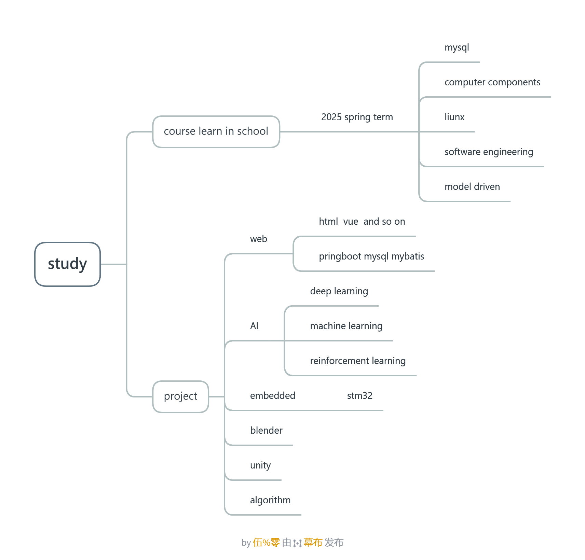

# yz
## About Learning Something New and Also Having Some Plans
This repository begins now, after I finish my task on a paper test about offline RL.  
Yes, in some way, I **suddenly** realized: **I have never learned a technical subject carefully.**  

When I ask myself what I can do, I find that the only thing I can do is use ChatGPT or other AI tools.  
So, now I create this repository to record my learning journey.  

## Some Tips
1. In this repository, all emails are in the GitHub email URL.
2. This repository may have some other resources I copied.
3. I may test a learning method using AI, so this repository will have an `AIT` (AI Teacher) module and discussions about ChatGPT.
4. There will be some errors in this module, and yes! It will also contain many `AIT` elements.

## Path of My Learning

## 珍宝
这里我引用我听到的一个教授说的一句话， 
学习一门专业课，必须要深入了解基本概念，否则知识门外汉，无法与专业的人士进行交谈，工作效率也十分低下。专业名词的掌握，是在专业领域具有对话能力的基础。深入了解一门课，必须依赖大量的论文，文章进行专业深度思考。所有能够查到的，很多人教导的知识，都是最基础的知识。真正重要的知识必须要自己进行思考，理解，明悟。也就是知易行难。