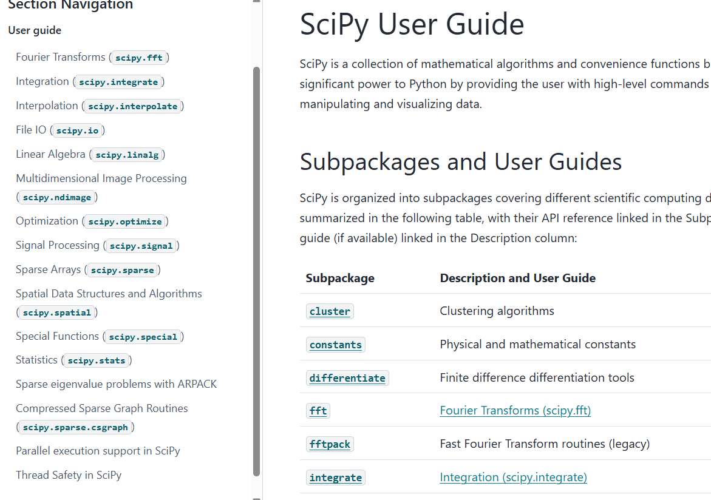
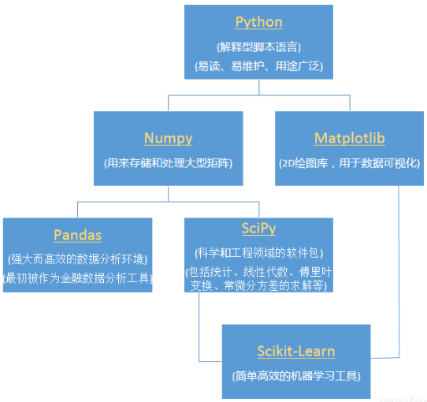

# 音频转化
## 学习背景
在做项目的过程中，也就是avn的那个parper，我需要将环境中已经采样好的数据重新进行转化为音频，然后分析音频的效果
## 代码
```
from scipy.io.wavfile import write
import numpy as np

# 假设声音数据是一个 NumPy 数组，采样率是 44100Hz
# 左右耳分不太清楚 ， 就随便起了名字
sample_rate = 44100  
left_audio_data = (audio_data[0] * 32767).astype(np.int16)
right_audio_data = (audio_data[1] * 32767).astype(np.int16)
# 写入 WAV 文件
write("outputaudio/left_output_125.wav", sample_rate, left_audio_data)  # 16位整数格式
write("outputaudio/right_output_125.wav", sample_rate, right_audio_data) 
```
## 知识
### 1. scipy 库
https://github.com/scipy/scipy.git github地址。<br>
scipy ： https://docs.scipy.org/doc/scipy/ 官方文档<br>
<br>
介绍scipy库：<br>
1. scipy库是一个比numpy更加高级的库，常用于处理数学工程天文学等的一个科学计算包，可以处理线性代数，快速傅里叶变化等数学问题。
2. 两者的区别：

借鉴某大佬的图片，致敬。
### 2. scipy io
scipy io是scipy中对于文件的io操作，从官网上看，io支持对于很多文件的操作，包括但是不限于matlab文件和wav文件，该处具体讲解对于wav的讲解。
Wav sound files (scipy.io.wavfile)<br>
read(filename[, mmap]) Open a WAV file.

write(filename, rate, data) Write a NumPy array as a WAV file.
从这里可以看到，这个地方支持对于音频的保存和打开，尤其是write接口，可以直接保存data数据到wav文件。
### 3. 遇到的问题
在使用wirte函数中，有两个具体的问题一定需要理解，第一个就是rate是什么，rate是采样率。如何理解这个采样率呢，其实可以认为，当你使用一个东西打开一个音频的时候，那么这个音频转化成为了数字信号，如果对于逻辑电路学的比较好的话，那么就可以理解采样的这个过程，就是按照一定的时间间隔将模拟信号转化为数字信号的这个频率。也就是采样率。
ok ，那么采样率一般是多少呢？44100现在的专业设备的采样率都是41khz，这个也是从网上找到的。
ok，搞定了采样率，那么怎么理解data呢？在第一个保存的时候我就犯了一个错误，因为我的data的数据格式是不对的，我的data是float32数据类型的也就是-1-1之间的，但是data的这个接受的数据范围是给出gpt的解释
```
音频数据的范围： 大部分音频数据，尤其是浮点型的音频数据，其值通常在 -1.0 到 1.0 之间。例如，audio_data[0] 可能代表某一时刻的音频信号的值，这个值可能在 -1.0 和 1.0 之间波动。

PCM 格式的范围： 在很多音频格式（特别是 16 位 PCM）中，音频数据以整数形式存储，并且其范围通常为 -32768 到 32767。因此，为了将浮点数据映射到 16 位 PCM 格式的整数范围，需要将其乘以 32767，这样就能将浮动的浮点值（-1.0 到 1.0）线性地转换到整数范围（-32768 到 32767）。

为什么乘以 32767： 32767 是 16 位有符号整数（int16_t）的最大值。在 PCM 编码中，音频信号常常被转换为这种 16 位整数值。通过乘以 32767，我们将浮点值按比例转换为适合存储的整数值，同时保持音频信号的音量比例不变。
```