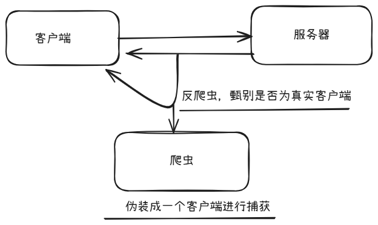

# python爬虫
技术学习缘由：最开始接触爬虫是准备去学习网络安全，后来在python选修课的时候大作业是爬虫，于是对爬虫进行了系统的学习，后来爬虫相关的知识就忘记了。之后再进行web插件开发的时候发现自己确实还需要对网络爬虫进行重新的学习。也确实觉得这个技术一个计算机的人肯定要会，于是在这里进行一次技术文档的书写。
### 个人理解
什么是爬虫，从我现在的角度来说，爬虫就是通过网络的传输，在传输的过程中对传输的数据进行捕获的过程。对于python来说，它已经把这个过程封装好了，所以我们只需要对这个过程进行使用就可以爬虫了。

### 所使用到的库
#### 1. urllib
https://docs.python.org/3/library/urllib.html<br>
python3 内置的库，可以看到就是这个urllib
一般情况下，我们大多数情况使用的就是urllib.request
```
import urllib.request as url
request = ulr.Request('url')
url.urlopen(request).read().decode('utf-8')
```
一定要进行解码，也就是read之后接上decode，否则返回的就是一个request对象

```
import urllib.request as url
request = url.Request(url='https://jwxt.bistu.edu.cn/jwapp/sys/wdkb/*default/index.do?EMAP_LANG=zh#/xskcb')
schedule_html = url.urlopen(request).read().decode('utf-8')
print(schedule_html)
```
如果该网站有反爬虫，那么就会进行重定向，也就是重定向到登录页面这个是很常见的一种情况，在这种情况下，我们就要使用python模仿一个客户端然后传入cookies或者是local storage。基于这种身份认证然后我们进入到网站内部。
